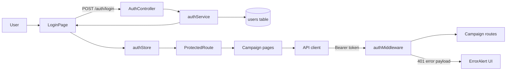
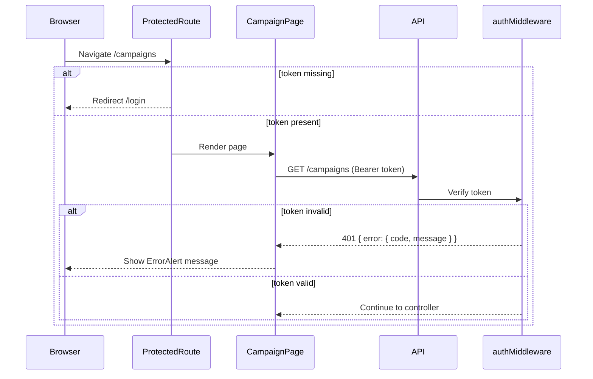

# VS-01 Architecture

## Data and Request Flow

- Frontend login form submits credentials to `POST /auth/login`.
- Backend validates payload, verifies credentials, and returns `{ token, user }`.
- Frontend stores token in in-memory Zustand state.
- API client reads token from store and attaches `Authorization: Bearer <token>` for protected API calls.
- Frontend route guard checks for token presence before rendering campaign routes.
- Backend auth middleware verifies JWT for protected route groups and returns `401` payloads on missing/invalid token.

## High-Level Flow Diagram

## Focused Sequence (Protected Access)

## Boundaries

- Frontend: `LoginPage`, `ProtectedRoute`, `authStore`, API client, error alert components.
- Backend: auth routes/controller/service, auth middleware, standardized error handler.
- Database: `users` table accessed by auth service credential verification.
- External: none for `VS-01` core flow.
