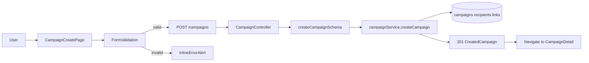
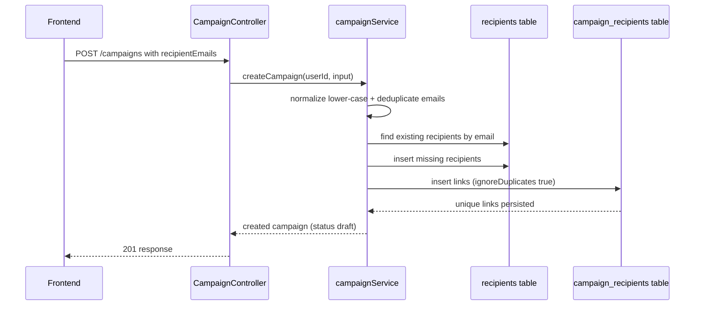

# VS-02 Architecture

## Data and Request Flow

- User fills campaign create form (`name`, `subject`, `body`, recipient emails).
- Frontend performs typed validation:
  - required non-empty text fields
  - recipient email format validation
  - duplicate recipient email detection
- On valid input, frontend submits `POST /campaigns`.
- Backend validates request body with Zod schema.
- Service opens DB transaction, creates `campaigns` row in `draft` status, upserts recipients, and inserts `campaign_recipients` links.
- Response returns created campaign payload; frontend invalidates list query and navigates to campaign detail.

## High-Level Flow Diagram

## Focused Sequence (Duplicate Recipient Prevention)

## Boundaries

- Frontend: create form, client-side validation, mutation lifecycle, user feedback.
- Backend: request validation, auth-protected endpoint, transactional campaign create orchestration.
- Database: `campaigns`, `recipients`, `campaign_recipients` with uniqueness/integrity constraints.
- External services: none for `VS-02`.
