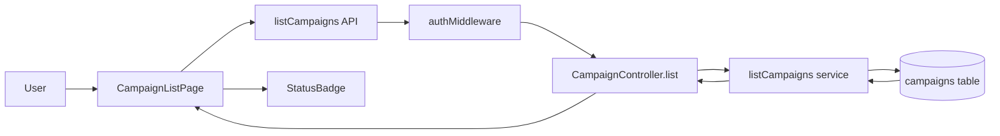
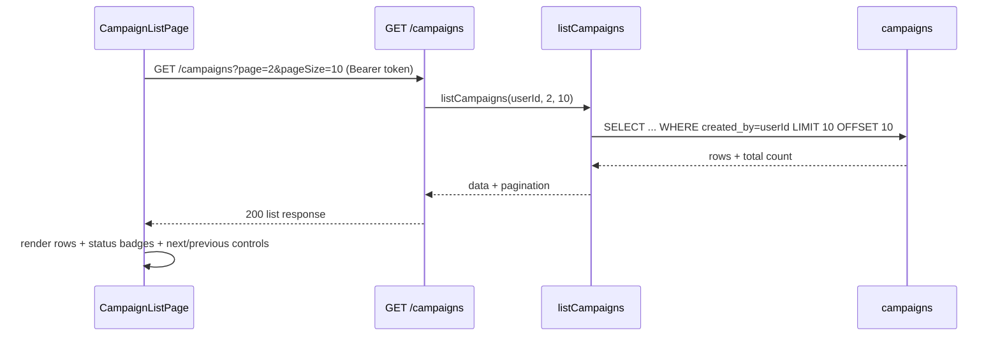

# VS-03 Architecture

## Data and Request Flow

- Authenticated user loads `/campaigns`.
- Frontend requests `GET /campaigns?page=<n>&pageSize=<m>` via shared API client.
- Backend auth middleware resolves `userId` from JWT.
- Campaign list use case queries campaigns filtered by `createdBy = userId`, sorted by newest first, with offset/limit pagination.
- Frontend renders list rows with reusable `StatusBadge` and pagination controls.
- Unknown status values (if ever returned) render through explicit fallback label and style.

## High-Level Flow Diagram

## Focused Sequence (Pagination + Ownership)

## Boundaries

- Frontend: list query lifecycle, list rendering, status badge mapping, pagination controls.
- Backend: auth-protected list endpoint, ownership filter, pagination metadata.
- Database: campaign records constrained by owner foreign key.
- External services: none.
