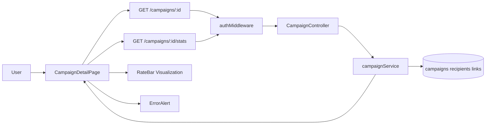
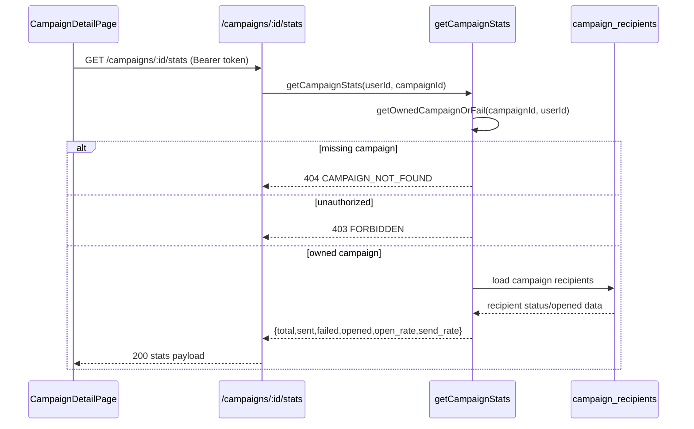

# VS-04 Architecture

## Data and Request Flow

- User opens `/campaigns/:id`.
- Frontend requests campaign detail and stats in parallel:
  - `GET /campaigns/:id`
  - `GET /campaigns/:id/stats`
- Backend auth middleware validates JWT and injects `userId`.
- Service enforces ownership via `getOwnedCampaignOrFail` before returning data.
- Detail response includes campaign core fields and recipient rows.
- Stats response includes required contract fields and derived rates.
- Frontend renders:
  - campaign detail and recipients
  - rate visualization via `RateBar`
  - explicit error alert for failed/not-authorized/not-found responses.

## High-Level Flow Diagram

## Focused Sequence (Ownership + Stats Contract)

## Boundaries

- Frontend: route/page orchestration, loading/error states, recipient/stats rendering.
- Backend: auth + ownership checks, detail and stats endpoint contracts.
- Database: campaign ownership and recipient delivery link records.
- External services: none.
