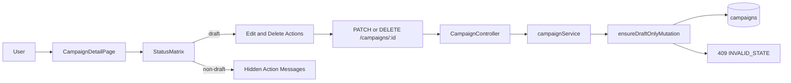
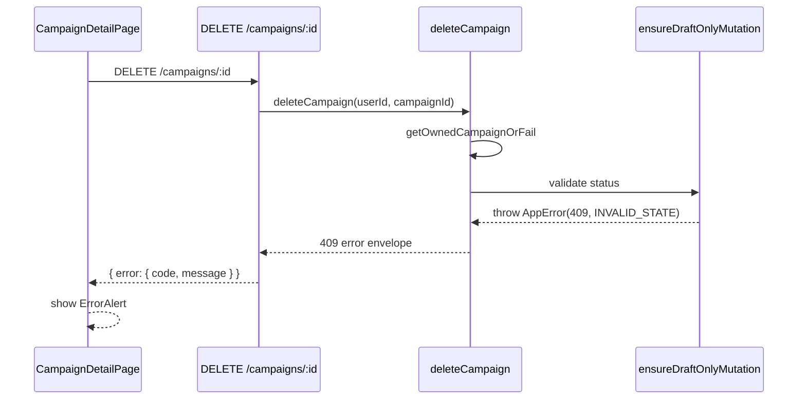

# VS-05 Architecture

## Data and Request Flow

- User opens campaign detail page.
- Frontend determines action availability from campaign `status`.
- For `draft` campaigns:
  - edit form is rendered and `PATCH /campaigns/:id` is enabled
  - delete button is enabled
- For non-draft campaigns:
  - edit/delete actions are hidden and explanatory copy is rendered
- Backend validates ownership, then enforces draft-only guard before update/delete mutation.
- Guard failures return standardized `409` error payload with machine-readable code.

## High-Level Flow Diagram

## Focused Sequence (Blocked Non-Draft Delete)

## Boundaries

- Frontend: action visibility matrix, edit/delete mutation triggers, user-facing error feedback.
- Backend: ownership checks + draft-only transition guard + standardized error response.
- Database: campaign lifecycle state persisted in `campaigns.status`; delete cascade handled by FK constraints for `campaign_recipients`.
- External: none.
