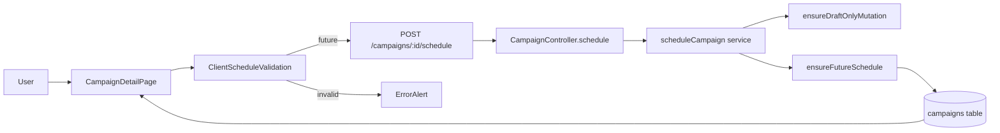
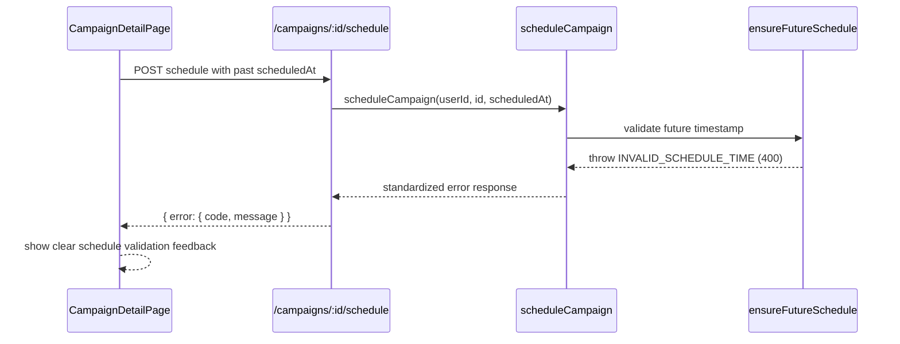

# VS-06 Architecture

## Data and Request Flow

- User opens campaign detail and can schedule only when campaign status is `draft`.
- Frontend validates `datetime-local` input is parseable and strictly in the future.
- On valid input, frontend sends `POST /campaigns/:id/schedule` with ISO timestamp.
- Backend validates auth, ownership, and lifecycle status (`draft` only), then validates future timestamp.
- Backend updates `campaigns.status` to `scheduled` and persists `scheduled_at`.
- Frontend refreshes detail/list queries and renders new scheduled state.

## High-Level Flow Diagram

## Focused Sequence (Past Timestamp Rejection)

## Boundaries

- Frontend: schedule control visibility, client validation, mutation error display.
- Backend: auth + ownership + lifecycle guard + future-time rule.
- Database: `campaigns.status` and `campaigns.scheduled_at`.
- External systems: none in this story scope.
