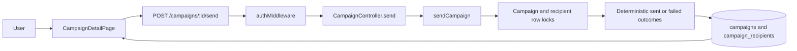
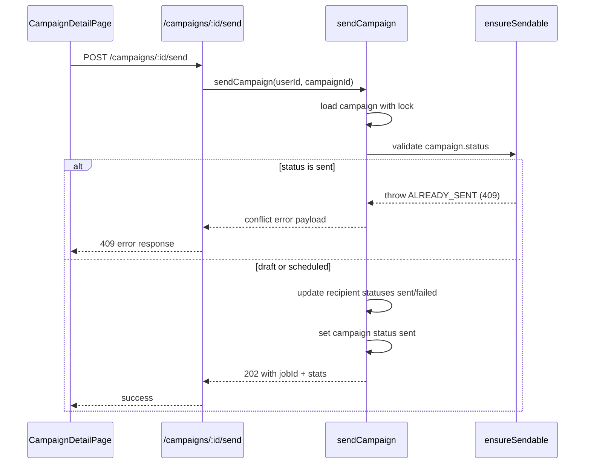

# VS-07 Architecture

## Data and Request Flow

- User triggers send action from campaign detail (only when status allows).
- Frontend calls `POST /campaigns/:id/send`.
- Backend validates auth + ownership and acquires campaign row lock in transaction.
- Lifecycle rule rejects already-sent campaigns with idempotent conflict.
- Service loads campaign recipients with row lock and computes deterministic outcome:
  - local-part contains `"fail"` => `failed`
  - otherwise => `sent` and `sent_at = now`
- Backend updates campaign to terminal `sent` and returns job ID + stats contract.
- Frontend refreshes list/detail/stats queries and shows terminal state.

## High-Level Flow Diagram

## Focused Sequence (Idempotent Conflict on Re-send)

## Boundaries

- Frontend: send action trigger, action visibility by status, post-send refresh/error feedback.
- Backend: transactional send orchestration, lifecycle guard, deterministic simulation policy.
- Database: campaign and campaign-recipient updates within one transaction.
- External: none (simulation-only send in MVP scope).
