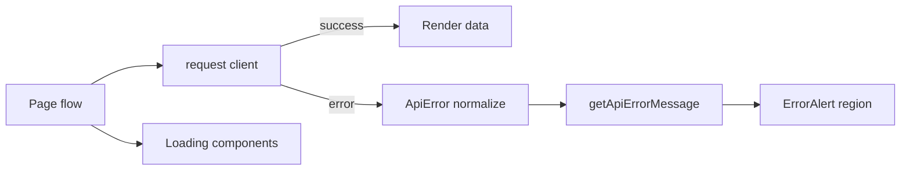
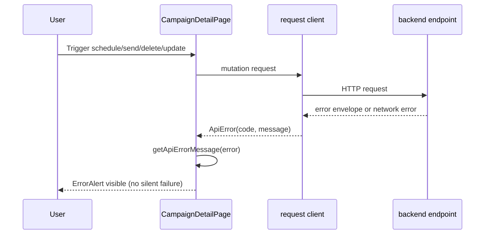

# VS-08 Architecture

## Data and Request Flow

- UI screens perform queries/mutations via shared API client.
- API client normalizes failures into `ApiError` with machine-readable codes:
  - backend envelope errors
  - network failures
  - non-envelope fallback API errors
- UI pages call shared `getApiErrorMessage(error, fallback)` to resolve user-friendly messages.
- Error region rendering is standardized through `ErrorAlert` in each flow.
- Loading states remain explicit:
  - `SkeletonList` for campaign list fetch
  - `LoadingSpinner` for detail/stat fetch
  - mutation button pending labels for form/action flows.

## High-Level Flow Diagram

## Focused Sequence (No Silent Mutation Failure)

## Boundaries

- Frontend: centralized error mapping utility, shared API client normalization, loading/error regions.
- Backend: consistent error envelope and machine-readable codes.
- External: network-level failure normalization at client boundary.
