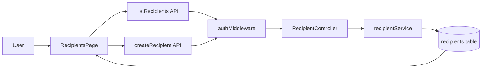
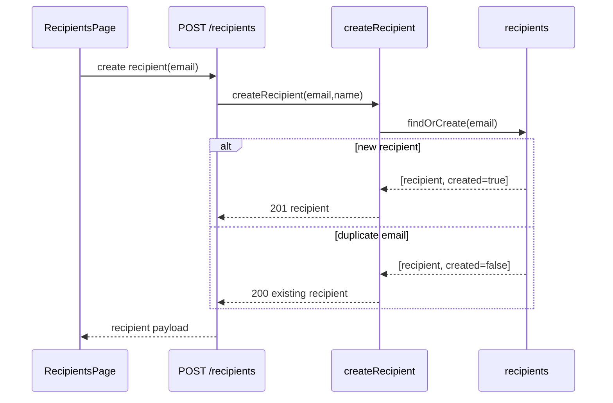

# VS-09 Architecture

## Data and Request Flow

- User navigates to `/recipients` (protected by auth guard).
- Frontend loads recipient list via `GET /recipients`.
- Backend auth middleware enforces authorized access before recipient controller logic.
- Frontend create form validates basic email format and submits `POST /recipients`.
- Backend validates request schema and executes `findOrCreate` on normalized email.
- Duplicate-email requests return existing recipient record (idempotent create policy).
- Frontend invalidates recipient list query after successful create.

## High-Level Flow Diagram

## Focused Sequence (Duplicate Email Policy)

## Boundaries

- Frontend: recipient list/create UI, local validation, query invalidation.
- Backend: recipient endpoint validation and idempotent duplicate behavior policy.
- Database: unique email constraint enforces recipient uniqueness.
- External: none.
