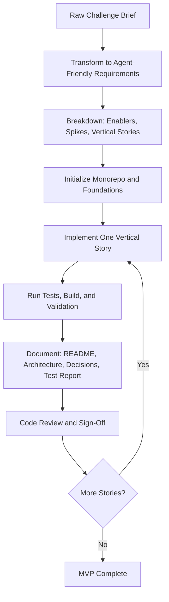

# AI Agent Workflow for Vertical Story Delivery

## Approach

The challenge is split into three areas (Backend, Frontend, and Agent showcase).  
Instead of implementing each area in isolation, this workflow applies a **vertical user story** strategy: ship feature slices end-to-end, with dependencies and blockers explicitly tracked.

This approach reflects a full-stack, product-owner mindset:

- prioritize testable user outcomes over isolated technical tasks
- surface dependencies early (enablers and spikes)
- keep implementation continuously releasable

## Preparation

Before implementation starts:

- research the requirement domain and expected MVP behavior
- gather and sort relevant project skills/rules by execution phase:
  - architecture and foundational setup skills
  - backend contract/business-rule skills
  - frontend UX/state-management skills
  - documentation and review skills
- align prompt usage and quality gates so each story has a repeatable execution pattern

## Requirement Transforming

### Step 1: Raw Challenge -> Agent-Friendly Requirement Docs

After understanding the challenge, transform requirements into explicit, implementation-ready documents:

```text
monorepo
 - backend
   + docs/initial-requirements
     + 01-schema-design.md
     + 02-api-endpoints.md
     + 03-business-rules.md
     + 04-tech-requirements.md
 - frontend
   + docs/initial-requirement
     + 01-pages-and-routing.md
     + 02-ui-features.md
     + 03-tech-requirements.md
```

Each document should include:

- implementation constraints
- contract boundaries
- expected error semantics
- decisions and trade-offs where ambiguity exists

### Step 2: Initial Requirements -> Feature Breakdown

Break requirements into two complementary groups:

1. **Enablers and Spikes (dependencies/blockers)**
   - Purpose: establish prerequisites that unblock multiple stories
   - Enablers: mandatory technical capabilities (auth middleware, shared API layer, routing baseline, etc.)
   - Spikes: timeboxed decisions for ambiguous or conflicting requirements
2. **Vertical User Stories**
   - Purpose: deliver user-visible value in small, testable increments
   - Each story references backend/frontend requirement sections
   - Each story explicitly maps dependencies, blockers, and required skills
   - Each story is split into backend and frontend subtasks with acceptance criteria

### Step 3: Context-Ready Project Initialization Prompting

Run project foundation prompts before story execution:

- [Monorepo codebase init prompt](../prompts/monorepo-code-base-init-prompt.md)

Goal:

- initialize monorepo/workspaces, baseline backend/frontend structure, migrations, and runtime foundations
- implement only foundational enablers, not user stories
- verify readiness by running build/test/migration/dev commands

### Step 4: Story-Based Prompting (Repeat per Story)

Pick stories in sequence and apply:

- [Vertical story implementation prompt](../prompts/vertical-story-implementation-prompt.md)

For each story:

- implement only that story plus required dependencies
- enforce strict scope boundaries
- produce documentation and validation outputs as part of delivery

### Step 5: Quality Gate, Verification, and Sign-Off (Repeat per Story)

After each story implementation:

- verify prompt instruction compliance and required skill usage
- run code review (subagent and manual review)
- validate generated story docs and ensure internal consistency
- execute and follow a concrete test plan before sign-off
- update [progress-log.md](../implementation/VS-01/progress-log.md) in the story folder (replace `VS-01` with your `STORY_ID`) so agents and humans can recover context quickly
- capture technical debt, bug follow-ups, and enhancement tasks in decisions/backlog notes

Recommended story document structure (under `docs/implementation/<STORY_ID>/`; concrete example: [VS-01](../implementation/VS-01/README.md)):

- [README.md](../implementation/VS-01/README.md)
- [progress-log.md](../implementation/VS-01/progress-log.md)
- [architecture.md](../implementation/VS-01/architecture.md)
- [decisions.md](../implementation/VS-01/decisions.md)
- [test-report.md](../implementation/VS-01/test-report.md)

## Workflow Diagram



## Agent Guardrails and Corrections

### Where the Agent Was Wrong or Needed Correction

Even with a strong prompt, the agent can still make mistakes. The workflow should explicitly capture and correct these quickly:

- **Missing a vital skill during implementation**
  - Example: implementing a frontend-heavy story but forgetting to apply the UI engineering skill, resulting in weak loading/error UX consistency.
  - Correction: explicitly map required skills in the story kickoff checklist and verify they were applied before sign-off.
- **Context-window loss in long sessions**
  - Example: after many turns, the agent forgets an early constraint such as "return `409` with machine-readable code for non-draft mutation" and accidentally returns `400`.
  - Correction: re-read the story contract and decision docs before final edits, then re-run targeted contract tests.
- **Third-party library version mismatch**
  - Example: the agent applies guidance for a different major version (for example, React Query v4 patterns in a v5 codebase), causing incorrect implementation details.
  - Correction: verify the exact installed version from project manifests/docs before coding, and align examples/tests with that version's API.
- **Wrong implementation style due to model routing differences**
  - Example: one model follows layered/domain-first boundaries while another model generates shortcut controller-heavy code, creating style inconsistency in the same feature.
  - Correction: enforce project rules/skills and architecture constraints as non-negotiable guardrails, then run style-aware review before merging.


### What I Would Not Let the Agent Do (and Why)

These are hard boundaries to protect reliability and trust:

- **Do not change scope beyond the selected story**
  - Why: avoids accidental architecture drift and unpredictable review scope.
- **Do not skip validation commands (tests/build/typecheck/lint)**
  - Why: prevents silent regressions and false “done” states.
- **Do not silently change contracts (API shape/status code/error code)**
  - Why: contract drift breaks frontend/backend alignment and test expectations.
- **Do not leave undocumented decisions**
  - Why: missing rationale forces future contributors to re-decide solved trade-offs.
- **Do not perform destructive repository actions without explicit approval**
  - Why: safeguards user work and maintains auditability.

### Practical Rule

Treat each story as a mini release:

1. implement only required behavior,
2. verify with commands and tests,
3. document decisions and evidence,
4. then sign off.

## Conclusion

This workflow is effective because it combines:

- **product clarity** (story-first outcomes)
- **engineering discipline** (dependency mapping and quality gates)
- **agent operability** (clear prompts, explicit context, repeatable documentation)

In practice, it reduces rework, improves traceability, and keeps the codebase continuously shippable while still supporting deep technical rigor.
